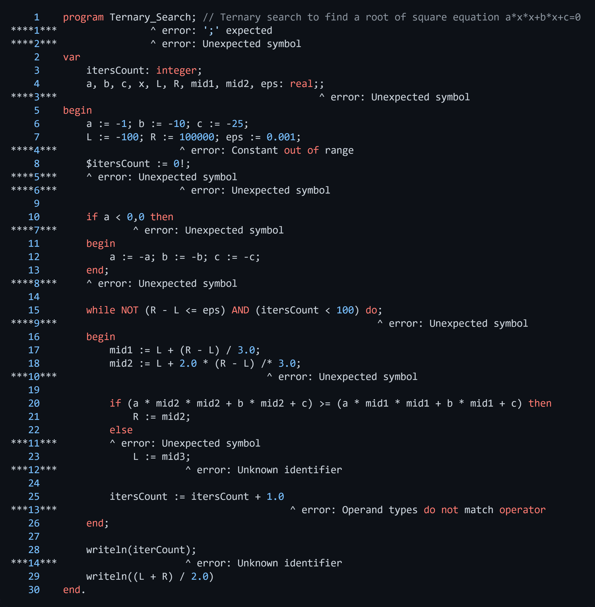
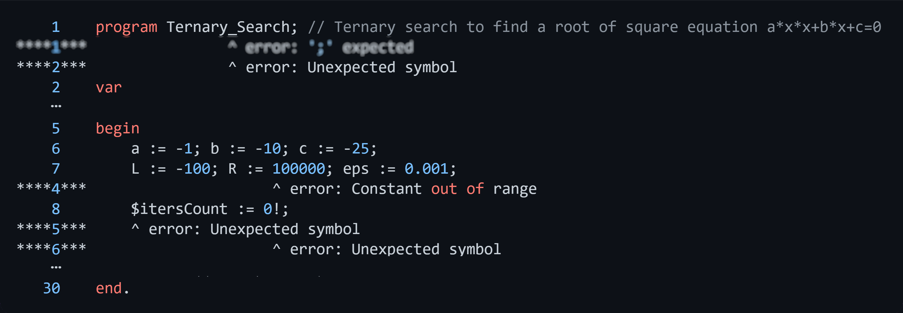
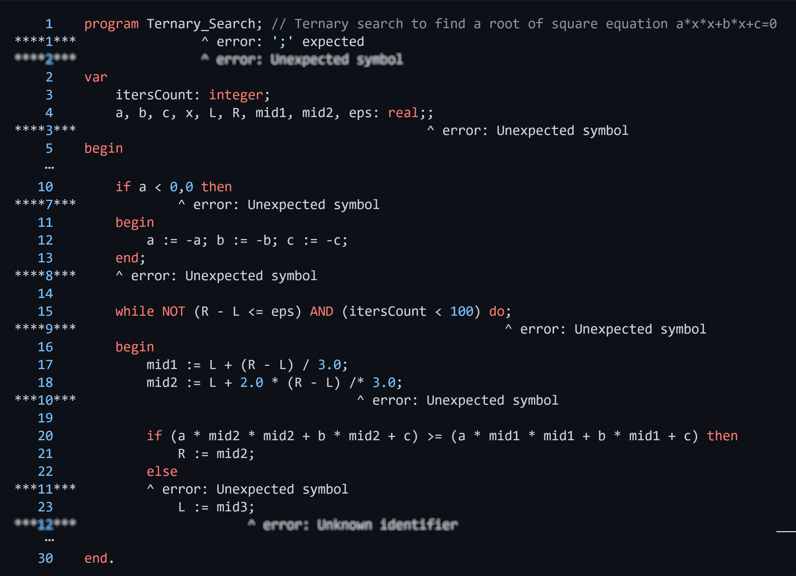
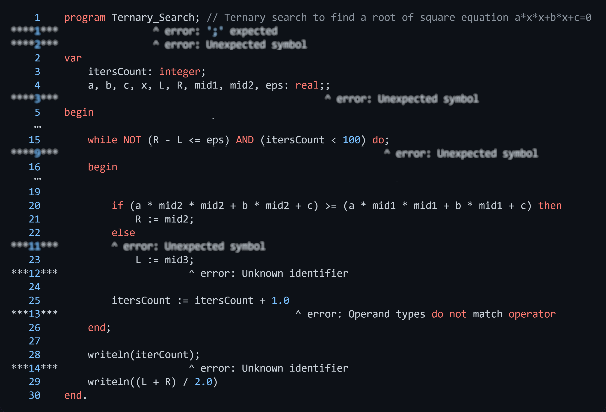
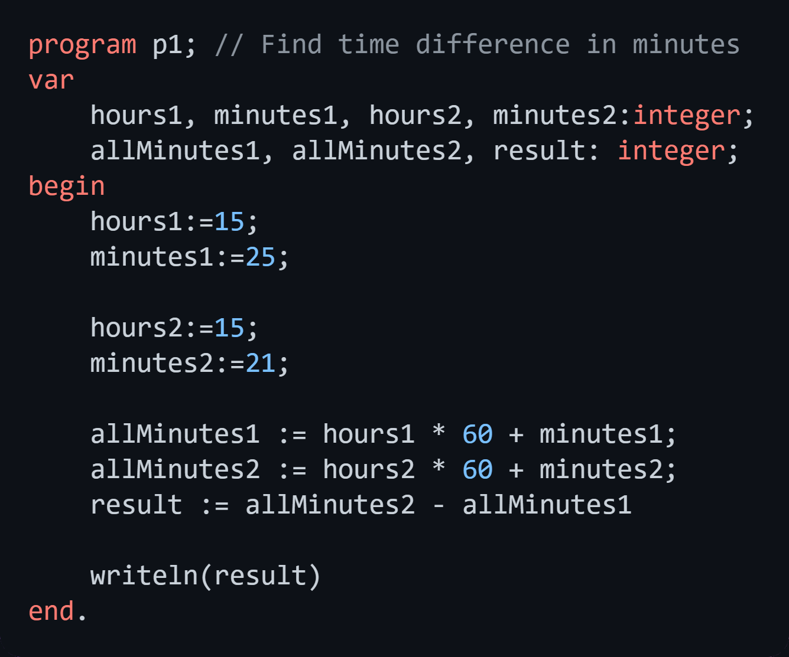

# Pascal JVM compiler

The project is implemented on educational purpose. Its main goal is getting experience in compiler implementation.

The compiler implements an analysis of a subset of Pascal language grammar. A Pascal program is translated to Java byte code. 

## Features

The compiler supports
* Type declaration block
* Variable declaration block (Boolean, Integer, Real, Char)
* Operators block
* Number constants
* Arithmetic and logical expressions (constants, variables, `+`, `-`, `*`, `/`, `=`, `<>`, `<`, `<=`, `>`, `>=`, `in`, `NOT`, `AND`, `OR`, `(`, `)`)
* Assignment operator (`:=`)
* Compound statement (`begin .. end`)
* Conditional statement (`if .. then ..`)
* `while`, `repeat`, `for` loops
* Functions declaration and invocation

## Example
In this README the work of the compiler is illustrated by the example of a Pascal program that implements a ternary search algorithm for square equation solution.
In each section one of the modules of the compiler is discussed and illustrated by a screenshot of the program parts containing the messages provided by the discussed module (other modules messages are blured). You can see a full program listing below. 



## Lexical analysis
Lexer is a compiler module which transforms a program text into a sequence of language symbols. It also reveals lexical errors:
* Constant range violation (i.e. for integer value the range is -32768..32767)
* Detection of the unsupported characters (i.e. `%`, `!`, `$`)



## Syntax analysis
Syntax Analyzer checks the sequence of symbols for language syntax rules and generates syntax errors.
For example, having a set of high-level BNF syntax rules and an if expression `a < 0,0`, Syntax Analyzer detects unexpected `,` and generates en error message.

`<if statement> ::= if <expression> then <statement> | if <expression> then <statement> else <statement>` </br>
`<expression> ::= <simple expression> | <simple expression> <relational operator> <simple expression>`</br>
`<simple expression> ::= <term> | <sign> <term>| <simple expression> <adding operator> <term>`</br>
`<term> ::= <factor> | <term> <multiplying operator> <factor>`</br>
`<factor> ::= <variable> | <unsigned constant> | ( <expression> ) | <function designator> | <set> | not <factor>` </br>
`<variable> ::= <identifier>`</br>
`<unsigned constant> ::= <unsigned number> | <string> | < constant identifier> < nil>` </br>
`<relational operator> ::= = | <> | < | <= | >= | > | in` </br>

Also, the Syntax Analyzer implements a basic error neutralization technics. Neutralization is a process of recovery after an error detection. For example, we can skip some sequence of symbols until we meet an appropriate symbol like in the expression above we skip `,`, `0` until we meet `then` that is a legal part of the if statement.



## Semantic analysis

Semantic analyzer checks the program for semantic errors. Supported types of errors:
* Occurrence of an undeclared identifier (type, variable, function) 
* Multiple identifier declaration
* Incompatible operands types of an operator
* Wrong number of arguments in function invocation



## Code generation

The module generates Java bytecode for provided Pascal program with the use of the library [ASM](https://asm.ow2.io). The compiler uses a core API of the library. While parsing a program, the Code Generator builds a sequence of Java bytecode instructions that operate on the list of local variables and operand stack.

An example of bytecode for a smaller program.



```
// class version 52.0 (52)
// access flags 0x1
public class PascalProgram {


  // access flags 0x9
  public static main([Ljava/lang/String;)V
   L0
    LOCALVARIABLE hours1 I L0 L1 1
    LOCALVARIABLE minutes1 I L0 L1 2
    LOCALVARIABLE hours2 I L0 L1 3
    LOCALVARIABLE minutes2 I L0 L1 4
    LOCALVARIABLE allMinutes1 I L0 L1 5
    LOCALVARIABLE allMinutes2 I L0 L1 6
    LOCALVARIABLE result I L0 L1 7
    LDC 15
    ISTORE 1
    LDC 25
    ISTORE 2
    LDC 15
    ISTORE 3
    LDC 21
    ISTORE 4
    ILOAD 1
    LDC 60
    IMUL
    ILOAD 2
    IADD
    ISTORE 5
    ILOAD 3
    LDC 60
    IMUL
    ILOAD 4
    IADD
    ISTORE 6
    ILOAD 6
    ILOAD 5
    ISUB
    ISTORE 7
   L1
    RETURN
    MAXSTACK = 0
    MAXLOCALS = 0
}
```